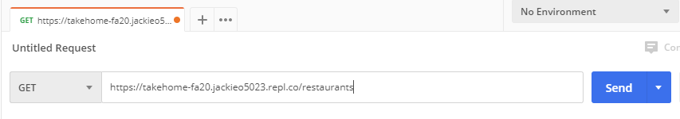
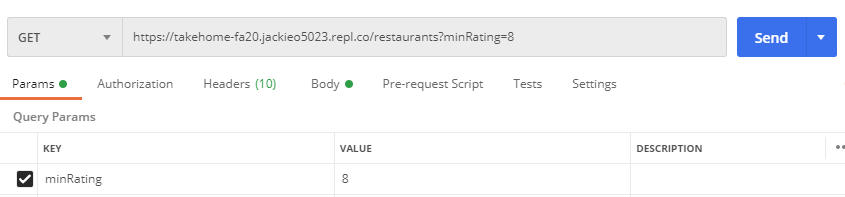
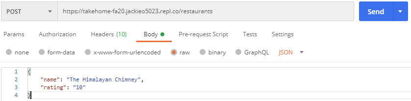

# The Challenge


The goal of this challenge is intended to expose you to and teach you some elements of our most common technical stack: a [React](https://reactjs.org/) frontend, and a Flask backend. We do not expect you to already be familiar with these technologies - so we will walk you through how to complete the exercise.

In terms of React resources, the following may be helpful:

[The React Beginner's Guide](https://flaviocopes.com/react-beginners-guide/) and [The Beginner's Guide to React](https://egghead.io/courses/the-beginner-s-guide-to-reactjs) will be very beneficial to go through to get a complete understanding on React fundamentals. It will also beneficial to get comfortable diving into [React Docs](https://reactjs.org/docs/hello-world.html) and [Javascript Docs](https://developer.mozilla.org/en-US/docs/Web/JavaScript/Reference) as part of this exercise.

Reading the following will help you get a sense of the big picture when it comes to developing APIs/writing server side code, and how it fits in the context of a larger web application:

- [How the Web Works](https://medium.freecodecamp.org/how-the-web-works-a-primer-for-newcomers-to-web-development-or-anyone-really-b4584e63585c) - Read all 3 parts, **especially part 3**!
- [Basics of HTTP](https://egghead.io/courses/understand-the-basics-of-http)

This project will be broken down into multiple parts. After you finish this project, you must submit it by following the instructions below.

*This exercise is due before this Sunday, January 27th at 11:59PM (CHANGE). If you have spent over 5 hours total, submit what you have!*

For any questions, feel free to email angad@hack4impact.org (CHANGE).

## Setup

First, fork this repository. The fork button on your top right. What this does is copies this repository over to your account. Now you should have a repository with the name `<yourusername>/takehome-fa20`.

We will be giving setup instructions for doing this challenge with repl.it, an in-browser IDE, in order to make setup a bit simpler.

Navigate to repl.it, and click "Sign Up" (if you don't already have an account). You may sign up however you like. Click the blue "+" button in the top right corner, and click "Import from GitHub". Paste your forked respository's name (`<yourusername>/takehome-fa20`) into the input box and click the blue "Import from GitHub" button. You may or may not be asked to provide authentication from GitHub - follow these instructions to allow repl to access your GitHub.

Postman will be useful for testing your backend as you go, you can install [here](https://www.getpostman.com/) and you will find instructions on how to use it to test the endpoints.

Make sure when you finish the challenge that you push your code to GitHub!!! **This is how we know you finished the challenge**.  You can do this by running:
```
git add .
git commit -m "Finish challenge"
git push origin master
```

# Exercise 

The following exercise will have you learn and apply some React and Flask to build a tool to keep track of restaurants you've tried.

## Flask
Follow the [backend instructions](backend/README.md) in order to set up repl.it to work with our backend.
### Part 1 - Already Done

```
GET /restaurants
```

This should return a properly formatted JSON response that contains a list of all the `restaurant`s in the mockdb. To call this endpoint, go to repl and copy the link in the window above your terminal (it should be formatted something like this `https://takehome-fa20.<your username>.repl.co`). Then, paste this link into Postman, append `/restaurants` to the end, and ensure it says `GET` to the left of the link. Click send. If you call this endpoint after starting the server, you should get this response in Postman:

```json
{
  "code": 200,
  "message": "",
  "result": {
    "restaurants": [
      {
        "id": 1, 
        "name": "Golden Harbor", 
        "rating": 10
      },
      {
        "id": 2, 
        "name": "Potbelly", 
        "rating": 6
      },
      {
        "id": 3, 
        "name": "Noodles and Company", 
        "rating": 8
      }
    ]
  },
  "success": true
}
```


You can see this endpoint implemented in `backend/app.py`, where you see `def get_all_restaurants():`. Here, we declare our endpoint by putting the code `@app.route("/restaurants", methods=['GET'])` above our declaration of the `get_all_restaurants()` function. This indicates that the function defined below the `@app.route` is called when someone routes a `GET` request to `/restaurants`. Within the funtion, we are using our provided helper function `create_response()` to create this formatted JSON resopnse, and passing in our restaurant data. This data is retrieved from our `db` object, by calling `get` on it.

No need to edit any code here! This is just an example. Now on to the next part...

### Part 2

Define the endpoint:

```
GET /restaurants/<id>
```

This should retrieve a single restaurant that has the `id` provided from the request. For example, `GET /restaurants/1` would return:

```json
{
  "code": 200,
  "message": "",
  "result": {
    "id": 1, 
    "name": "Golden Harbor", 
    "rating": 10
  },
  "success": true
}
```

If there doesn't exist a restaurant with the provided `id`, return a `404` with a descriptive `message`.

To start off, we need to create a function, and tell Flask that it's a `GET` endpoint. We can do this by writing the following code:
```python
@app.route("/restaurants/<id>", methods=['GET'])
def get_restaurant(id):
  pass
```
Right now, this code does absolutely nothing if we call this endpoint! We need to find the specific restaurant, and return it as a response to the user. To find a restaurant, given an id, we can call `db.getById('restaurants', int(id))`. We also know we have our handy helper function `create_response()` to format our JSON response. Now, we can make our function look like this:
```python
@app.route("/restaurants/<id>", methods=['GET'])
def get_restaurant(id):
  restaurant = db.getById('restaurants', int(id))
  return create_response(restaurant)
```
If we call our endpoint in Postman, it may look correct. But we're missing one important part! What happens when we call it on an id that doesn't exist, like 15? We need to fix that according to our specification mentioned above. If our `db` doesn't find the restaurant with the given id, it will return `None`. So, we can modify the above code to something like this:
```python
@app.route("/restaurants/<id>", methods=['GET'])
def get_restaurant(id):
  restaurant = db.getById('restaurants', int(id))
  if restaurant is None:
    return create_resopnse(status=404, message="No restaurant with this id exists")
  return create_response(restaurant)
```
And now we're done with part 2!

### Part 3

Extend the first `/restaurants` enpoint by adding the ability to query the restaurants based on the rating they have. You should _not_ use a url parameter like you did in Part 2. Instead, use a [query string](https://en.wikipedia.org/wiki/Query_string).

If `minRating` is provided as a query string parameter, only return the restaurants which have that rating or above. If there are no such restaurants, return a `404` with a descriptive `message`.

For this exercise, you can ignore any query string parameters other than `minRating` and you may assume that the provided parameter will be an integer represented as a string of digits.

In Postman, you can supply query string parameters writing the query string into your request url or by hitting the `Params` button next to `Send`. Doing so will automatically fill in the request url.

The following should happen

```json
GET /restaurants?minRating=8

{
  "code": 200,
  "message": "",
  "result": {
    "restaurants": [
      {
        "id": 2, 
        "name": "Golden Harbor", 
        "rating": 10
      },
      {
        "id": 3, 
        "name": "Noodles and Company", 
        "rating": 8
      }
    ]
  },
  "success": true
}
```



For this part, we'll need to work off our existing function `get_all_restaurants()`. Since we're using a query string instead of a url parameter, we'll need to figure out how to parse this from the url. Luckily, Flask provides us a way to do this with `request` (which is already imported for you). You can simply do `request.args.get('minRating')`, and it will return either the string value of the parameter, or `None`.

Here's a basic structure of how this function should look. Make sure to fill in the rest with your own logic, and ensure the correct error is returned when no restaurants are found.

```python
@app.route("/restaurants", methods=['GET'])
def get_all_restaurants():
    restaurants = db.get('restaurants')
    minRating = request.args.get('minRating')
    filtered_restaurants = []

    # Put your code here!
    
    return create_response({"restaurants": filtered_restaurants})
```

### **Parts 4, 5, and 6 are not required and will not impact your candidacy! Only do them if you would like extra practice :)**

### Part 4

Define the endpoint:

```
POST /restaurants
```

This endpoint should create a new restaurant. Each request should also send a `name`, and `rating` parameter in the request's `body`. The `id` property will be created automatically in the mockdb.

A successful request should return a status code of `201` and return the newly created restaurant (in the same format as Part 2).

If any of the required parameters aren't provided, DO NOT create a new restaurant in the db and return a `422` with a useful `message`. In general, your messages should provide the user/developer useful feedback on what they did wrong and how they can fix it.

This is how you can send `body` parameters from Postman. Make sure you don't mistake this for query parameters!


### Part 5

Define the endpoint:

```
PUT /restaurant/<id>
```

Here we need to provide a restaurant's `id` since we need to specify which restaurant to update. The `body` for this request should contain the same attributes as the `POST` request from Part 4.

However, the difference with this `PUT` request is that only values with the provided keys (`name`, `rating`) will be updated, and any parameters not provided will not change the corresponding attribute in the restaurant being updated.

You do not need to account for `body` parameters provided that aren't `name`, or `rating`.

If the restaurant with the provided `id` cannot be found, return a `404` and a useful `message`.

If you do find the restaurant, return it in the same way you did in Part 4 with the updated values.

### Part 6 - Already Done

Define the endpoint:

```
DELETE /restaurant/<id>
```

This will delete the restaurant with the associated `id`. Return a useful `message`, although nothing needs to be specified in the response's `result`.

If the restaurant with the provided `id` cannot be found, return a `404` and a useful `message`.

## React
Follow the [frontend instructions](frontend/README.md) in order to set up repl.it to work with our frontend.
### Part 1

Goal: Get familiar with JSX syntax, component structure, and passing props

Tasks:
* Send a `complete` prop into the `Instructions` component that determines whether or not to display a second line of text [Hint](https://reactjs.org/docs/conditional-rendering.html)

### Part 2
Goal: Get familiar with component state

Tasks:
* Open the empty `Counter` component file
* Set its initial state of `count` to `0`
* Display the value of the current count
* Create two buttons, one that increments the count and one that decrements it. [Hint](https://egghead.io/lessons/react-use-component-state-with-react)

### Part 3
Goal: Use nested components and props.

Tasks:
* Open the empty `Show` component which takes a shows `id`, `name`, and `episodes_seen`.
* Display the show name
* Modify the `Counter` component to take the initial count as a prop, and use this value for `count` in the initial state.
* Display a `Counter` (Look how we nested `Instructions` into `App`) and pass the number of episodes watched as prop to `Counter`
* To check that this works, just look at your running app, you should see 3 show names, each of which should have a counter next to it.

### Part 4 - Already Done
Goal: Get familiar with rendering lists and javascript array functions

Tasks:
* In the `App` component, create an initial state with a list of shows where each show has a name and a number of episodes seen. Use this [data](backend/mockdb/dummy_data.py)
* Display each show by passing each show's attributes as props to a `Show` component
* Do this without using `for` or `while` loops
* Very useful videos to watch:
 * [Functional Programming Intro](https://www.youtube.com/watch?v=BMUiFMZr7vk&index=1&list=PL0zVEGEvSaeEd9hlmCXrk5yUyqUag-n84) - just the first two videos are enough, although there's a lot to learn from the rest of the playlist and his other videos! (highly recommend subscribing)
 * [Rendering lists in React](https://egghead.io/lessons/egghead-use-the-key-prop-when-rendering-a-list-with-react)

### Part 5 
Goal: Get familiar with user input

Tasks:
* In `App.js`, make an input and a submit button that adds a new show to the state (set the new show's `id` to the next integer, and the `episodes_seen` to 0)
* Note: If your button refreshes the whole page, throw in a button type: `<button type="button" ...`
