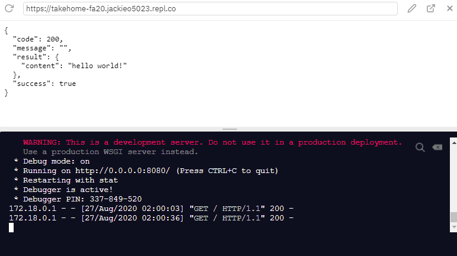

# Flask Backend

### Requirements

- [Postman](https://www.getpostman.com/)

Another great resource for anything on python, including installation is [The Hitchhiker's guide to python](https://docs.python-guide.org/).

### Setup

First, make sure you are on the repl.it page for the takehome. We'll walk through how to setup your virtual environment and install the python dependencies required to run this app. We're using virtualenv, which is a virtual Python environment isolated from other Python projects, incapable of interfering with or being affected by other Python programs on the same machine. You are thus capable of running different versions of the same package or even different python versions.

You should see a terminal in the bottom right corner of your repl page. Navigate to the backend directory (if you are still in the parent directory, you can do this by running `cd backend`), and run the following commands:

```
pip3 install virtualenv
virtualenv -p python3 venv
```

You must be in this virtual environment to install dependencies and start this server. Once you do this, you will see `(venv)` preceding your prompts. To do that:

```
source venv/bin/activate
```

Then to install dependencies, run:

```
pip install -r requirements.txt
```

Then, to start the server run:

```
python app.py
```

You should see something like this (with the url replacing `jackieo5023` with your own GitHub username):


To stop the server, press `Control-C`.

To exit your virtual environment, run:

```
deactivate
```

### Overview

These exercises will walk you through creating a RESTful API using Flask! We don't want you to go through all the hassle of setting up a database instance, so we have created dummy data and a mock database interface to interact with it. For the sake of ease, the entire app logic minus the mockdb logic will by implemented in `app.py`. For larger projects, the API endpoints will usually be separated out into different files called `views`.

Take a look into the mock database. The initial dummy data is defined in `mockdb/dummy_data.py`. This is what will "exist" in the "database" when you start the server.

The functions defined in `mockdb/mockdb_interface.py` are how you can query the mockdb. In `app.py`, where you will be writing your API, this has been imported with the name `db`. Therefore when you write the code for your endpoints, you can call the db interface functions like `db.get('restaurants')`.

When you modify your code within repl, the server will automatically update, _unless_ your code doesn't compile, in which case the server will stop running and you have to manually restart it after fixing your code.

For instructions on completing the exercise, look at the [README.md](../README.md) in the main directory.