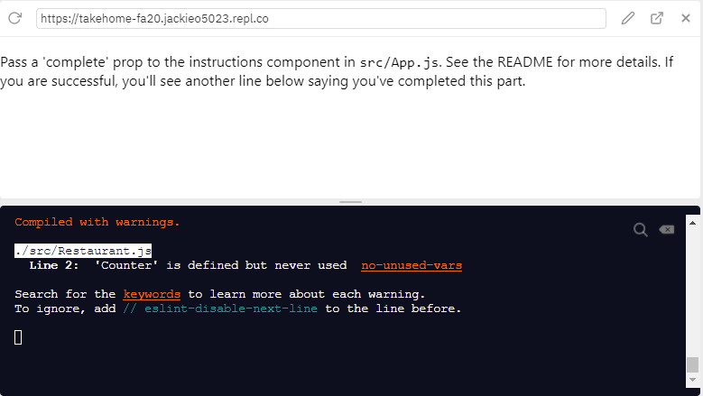

# React.js Frontend

### Setup

Install the [React Devtools](https://github.com/facebook/react-devtools) to easily debug and see what's going on in your React app.

First, make sure you are on the repl.it page for the takehome. We'll walk through the steps to run the frontend from here.

You should see a terminal in the bottom right corner of your repl page. Navigate to the frontend directory (if you are still in the parent directory, you can do this by running `cd frontend`, and if you are in the backend directory, you can do this by running `cd ..` followed by `cd frontend`), and run the following commands:

```
npm install
npm start
```

After everything completes, you should see something like this (with the url replacing `jackieo5023` with your own GitHub username):


To stop the client, press `Control-C`.

To restart the client, run `npm start`. Make sure you are in the frontend directory! You may also need to hit the "refresh" button in the repl browser.

### Overview

These exercises will walk you through creating a web client using React! While we don't expect you to be familiar with React, this will hopefully give you a breif introduction to the framework. The [React documentation](https://reactjs.org/docs/getting-started.html) is a great resource to refer to if you would like extra help or context.

---------

For instructions on completing the exercise, look at the [README.md](../README.md) in the main directory.